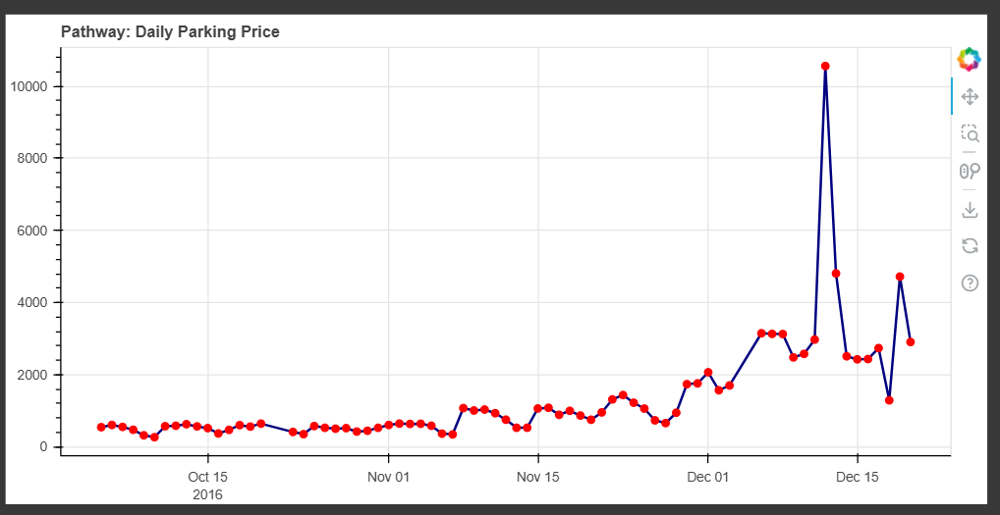
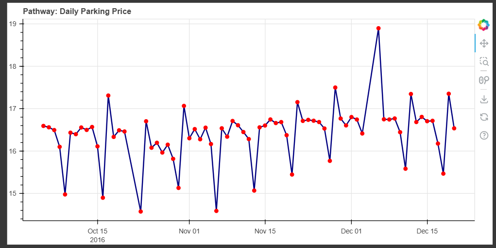

# 🚗 Dynamic Pricing for Urban Parking Lots

## 📌 Overview
This project builds a real-time pricing system for urban parking lots, adjusting fees dynamically based on occupancy, queue length, traffic, and events to maximize utilization and revenue. Two models are implemented and compared:
- **Model 1:** Baseline linear pricing
- **Model 2:** Demand-based pricing with multiple features

---

## 💻 Tech Stack
- **Python 3**: Core implementation
- **Pandas, Numpy**: Data manipulation
- **Pathway**: Real-time data processing
- **Bokeh**: Interactive visualizations
- **Google Colab**: Development environment

---

## 🏗️ Architecture
- **Data ingestion:** CSV data streamed through Pathway, simulating real-time updates.
- **Windowing:** Daily tumbling windows aggregate occupancy and other metrics.
- **Pricing models:** Two methods calculate prices per lot per day:
  - Model 1: Linear function of occupancy
  - Model 2: Composite demand function (occupancy, queue, traffic, special day, vehicle type)
- **Visualization:** Real-time Bokeh plots show price evolution for both models.

---

## 📈 Demand Function (Model 2)
\[
\text{Demand} = 0.5 \cdot \text{OccupancyRatio} + 0.3 \cdot \frac{\text{QueueLength}}{10} + 0.4 \cdot \text{TrafficWeight} + 0.2 \cdot \text{IsSpecialDay} + 0.1 \cdot \text{VehicleWeight}
\]
- Demand is normalized to [0,1], and price is:
\[
\text{Price} = \text{BasePrice} \times (1 + \lambda \cdot \text{NormalizedDemand})
\]

---

## 📊 Visual Results

### Model 1: Baseline Pricing

### Model 2: Demand-Based Pricing

---

## 🔎 Key Insights
✅ Baseline model responds quickly but causes price spikes.  
✅ Demand-based model produces smoother, more stable pricing.  
✅ Adding real-world features (queue, traffic, events) improves realism.

---

## 📌 Conclusion
This project demonstrates how combining occupancy data with additional demand factors leads to stable, realistic dynamic pricing for parking lots, improving utilization and customer satisfaction.

---
